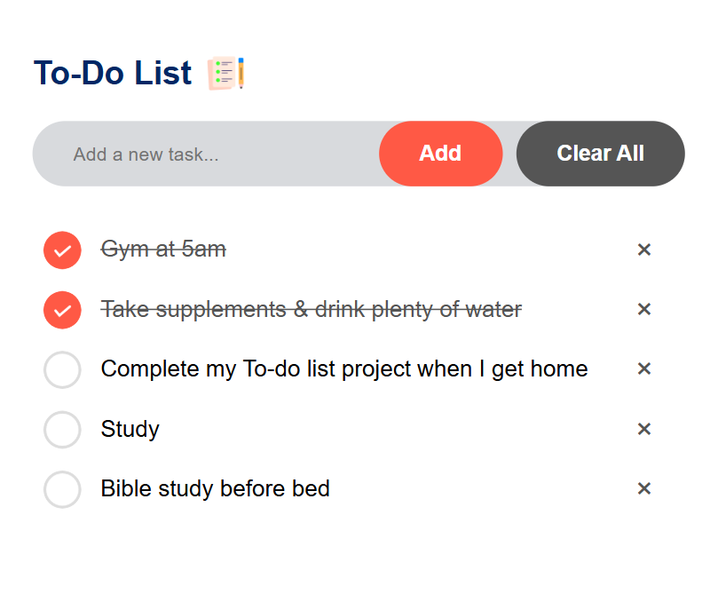

# 📝 To-Do List App

A clean and responsive to-do list application built using HTML, CSS, and JavaScript.

This app allows users to add, complete, and delete daily tasks through a simple and interactive interface.

---

## 🚀 Features

- Add new tasks
- Mark tasks as completed
- Delete tasks
- Interactive user interface
- Responsive design
- Task status icons

---

## 🛠 Technologies Used

- HTML
- CSS
- JavaScript

---

## 📸 App Screenshot

---

## 👩🏽‍💻 Author

Candice Mhlanga

